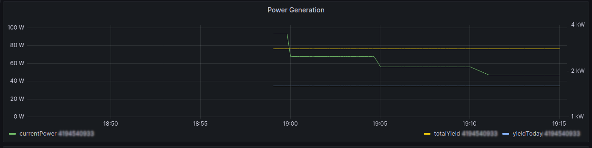

# solar-grabber
Small service to pull data from Deye's SUNxxx Microinverters (not from the cloud) and push it into an database. 
Currently only the SUN600 is supported, and only InfluxDB is supported.

The data transferred is the current power generation, the power generated today and the total power generated.
This is how it could look on a Grafana board:

## How to install
* Download the [latest binary here (click the topmost run)](https://github.com/Bytekeeper/solar-grabber/actions).
* Unpack it `sudo unzip artifact.zip -d /bin/` 
* Do a `sudo chmod u+x /bin/sun-status-grabber`
* Download the [config file](https://github.com/Bytekeeper/solar-grabber/blob/main/sun-status-grabber.conf) and save it it `/etc/`
* Now edit `/etc/sun-status-grabber.conf` and replace the example values, you can add multiple inverters and/or InfluxDBs
* If you're using `systemd` (you most likely are):
  * Download the [timer](https://github.com/Bytekeeper/solar-grabber/blob/main/solar_grabber.timer) and [service](https://github.com/Bytekeeper/solar-grabber/blob/main/solar_grabber.service)
  * Copy them to `/etc/systemd/system/`
  * Now run `sudo systemctl enable solar_grabber.timer`
  * Followed by `sudo systemctl start solar_graber.timer`
  * It will run the grabber every minute
  * You can edit the config at any time, it will automatically use the new settings
